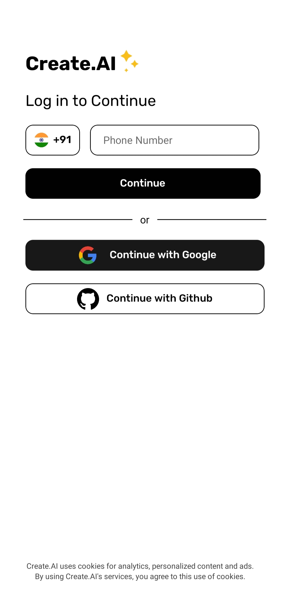
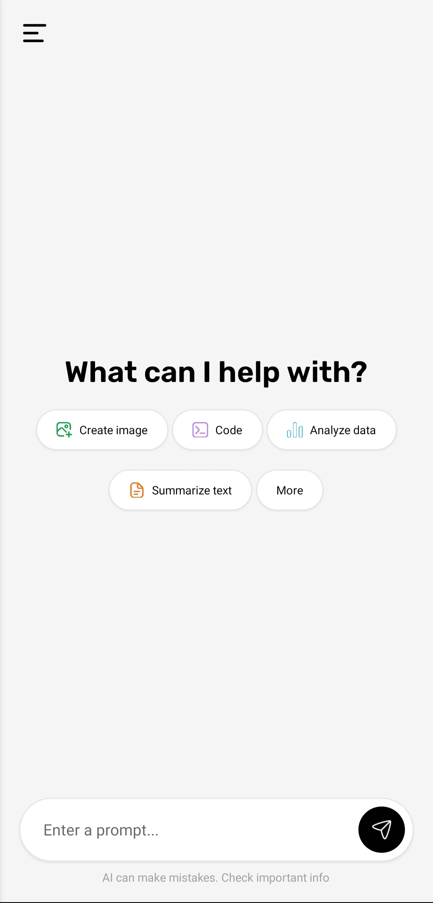
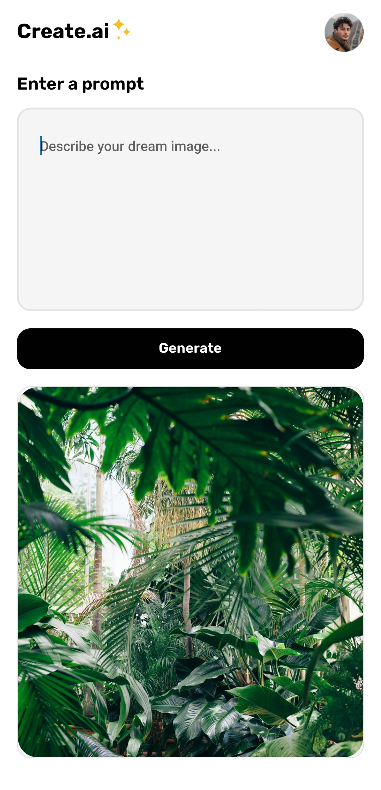

# Welcome to Create.ai 👋

This is an [Expo](https://expo.dev) project created with [`create-expo-app`](https://www.npmjs.com/package/create-expo-app).

<div style="display: flex; flex-wrap: wrap; gap: 10px;">
  
  
  
  
  
</div>

## Get started
1. Download or clone the repository and navigate to client
 ```bash
 cd client
 ```

2. Install dependencies

   ```bash
   npm install
   ```

2. Start the app

   ```bash
    npx expo start
   ```

In the output, you'll find options to open the app in a

- [development build](https://docs.expo.dev/develop/development-builds/introduction/)
- [Android emulator](https://docs.expo.dev/workflow/android-studio-emulator/)
- [iOS simulator](https://docs.expo.dev/workflow/ios-simulator/)
- [Expo Go](https://expo.dev/go), a limited sandbox for trying out app development with Expo

You can start developing by editing the files inside the **app** directory. This project uses [file-based routing](https://docs.expo.dev/router/introduction).


## Learn more

To learn more about developing your project with Expo, look at the following resources:

- [Expo documentation](https://docs.expo.dev/): Learn fundamentals, or go into advanced topics with our [guides](https://docs.expo.dev/guides).
- [Learn Expo tutorial](https://docs.expo.dev/tutorial/introduction/): Follow a step-by-step tutorial where you'll create a project that runs on Android, iOS, and the web.

## Join the community

Join our community of developers creating universal apps.

- [Expo on GitHub](https://github.com/expo/expo): View our open source platform and contribute.
- [Discord community](https://chat.expo.dev): Chat with Expo users and ask questions.

## Getting Started Server

1. Navigate to server directory:

   ```bash
   cd server
   ```
2. Install dependencies:

   ```bash
   npm install
   ```
3. Start the server:
   ```bash
   npm run dev
   ```

# API Documentation

## Overview

This document provides an overview of the API routes, models, and controllers used in this project.

## Routes

### User Routes

- **File:** [server/routes/UserRoutes.js](server/routes/UserRoutes.js)
- **Controller:** [server/controllers/UserController.js](server/controllers/UserController.js)

| Route          | Method | Description                   |
| -------------- | ------ | ----------------------------- |
| `/register`    | POST   | Register a new user           |
| `/verifyOtp`   | POST   | Verify OTP for user registration |

### AI Routes

- **File:** [server/routes/AiRoutes.js](server/routes/AiRoutes.js)
- **Controller:** [server/controllers/AIController.js](server/controllers/AIController.js)

| Route              | Method | Description                   |
| ------------------ | ------ | ----------------------------- |
| `/generateText`    | POST   | Generate text using AI        |
| `/generateImage`   | POST   | Generate image using AI       |

### Chat Routes

- **File:** [server/routes/chatRoutes.js](server/routes/chatRoutes.js)
- **Controller:** [server/controllers/ChatController.js](server/controllers/ChatController.js)

| Route                    | Method | Description                   |
| ------------------------ | ------ | ----------------------------- |
| `/addMessage`            | POST   | Add a new chat message        |
| `/ChatHistory/:chatId`   | GET    | Get chat history by chat ID   |

## Models

### User Model

- **File:** [server/models/UserSchema.js](server/models/UserSchema.js)

| Field        | Type    | Description                   |
| ------------ | ------- | ----------------------------- |
| phoneNumber  | String  | User's phone number           |
| fullName     | String  | User's full name              |
| isVerified   | Boolean | User's verification status    |

### Chat Model

- **File:** [server/models/ChatSchema.js](server/models/ChatSchema.js)

| Field    | Type   | Description                   |
| -------- | ------ | ----------------------------- |
| chatId   | String | ID of the chat                |
| sender   | String | Sender of the message         |
| text     | String | Text of the message           |

## Controllers

### User Controller

- **File:** [server/controllers/UserController.js](server/controllers/UserController.js)

| Function      | Description                                           |
| ------------- | ----------------------------------------------------- |
| `register`    | Registers a new user and sends OTP for verification   |
| `verifyOtp`   | Verifies the OTP sent to the user's phone number      |

### AI Controller

- **File:** [server/controllers/AIController.js](server/controllers/AIController.js)

| Function          | Description                                           |
| ----------------- | ----------------------------------------------------- |
| `generateText`    | Generates text based on the provided prompt           |
| `generateImage`   | Generates an image based on the provided prompt       |

### Chat Controller

- **File:** [server/controllers/ChatController.js](server/controllers/ChatController.js)

| Function          | Description                                           |
| ----------------- | ----------------------------------------------------- |
| `addMessage`      | Adds a new message to the chat                        |
| `getChatHistory`  | Retrieves the chat history for a given chat ID        |

## AI Integrations

### Gemini AI

- **File:** [server/ai-integrations/gemini.js](server/ai-integrations/gemini.js)
- **Description:** Integrates with Google Generative AI for text generation.

### Image Generation

- **File:** [server/ai-integrations/image.generation.js](server/ai-integrations/image.generation.js)
- **Description:** Integrates with Monster API for image generation.

## Utilities

### JWT Utility

- **File:** [server/utils/jwt.js](server/utils/jwt.js)
- **Description:** Generates JWT tokens for user authentication.

## Database

### MongoDB Connection

- **File:** [server/db.js](server/db.js)
- **Description:** Connects to the MongoDB database using Mongoose.

## Environment Variables

- **File:** [server/.env](server/.env)
- **Description:** Contains environment variables for the project.

